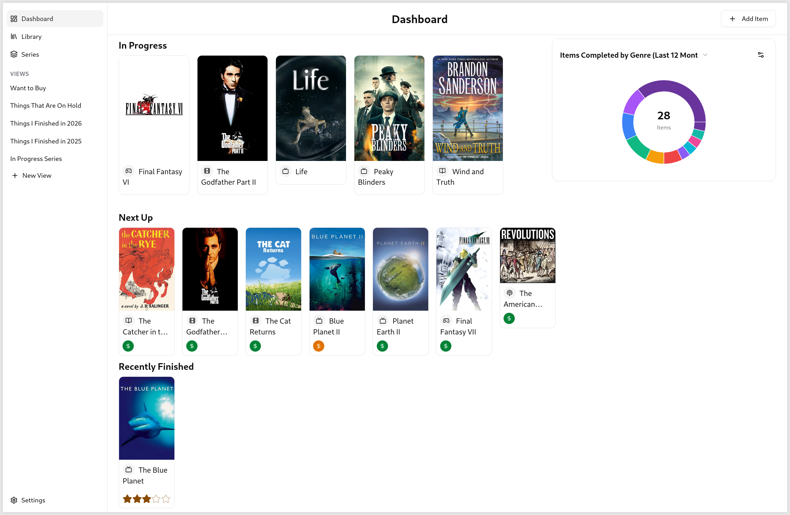
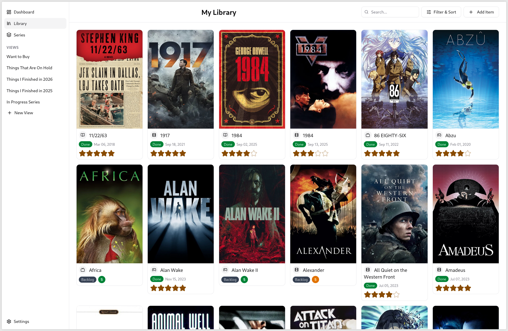
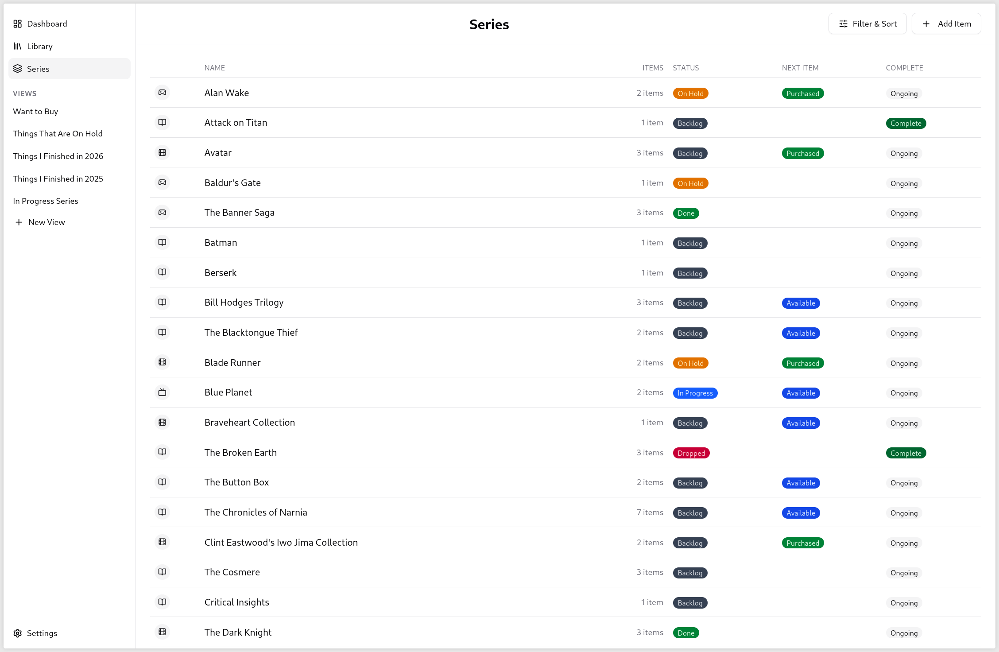
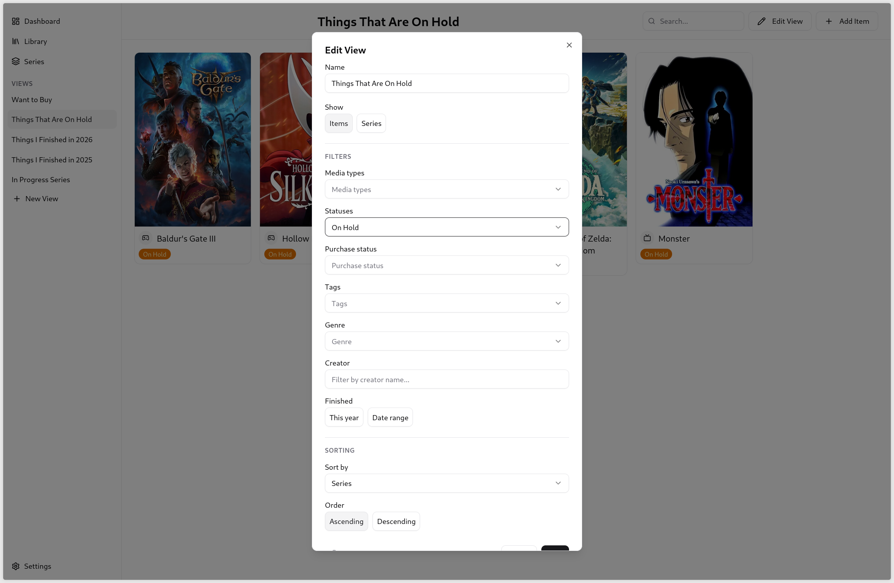
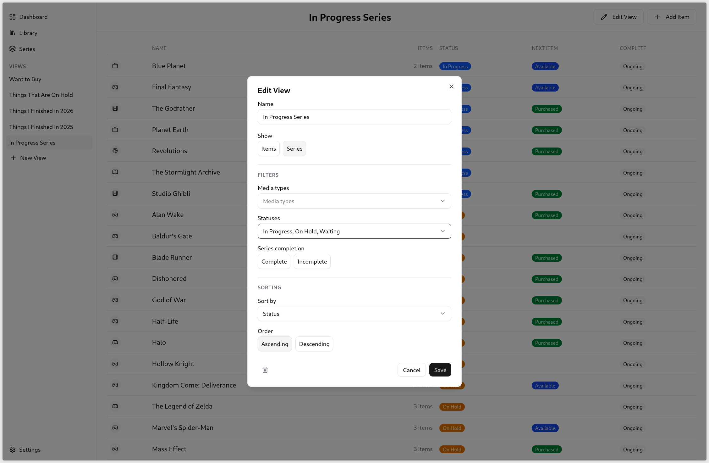
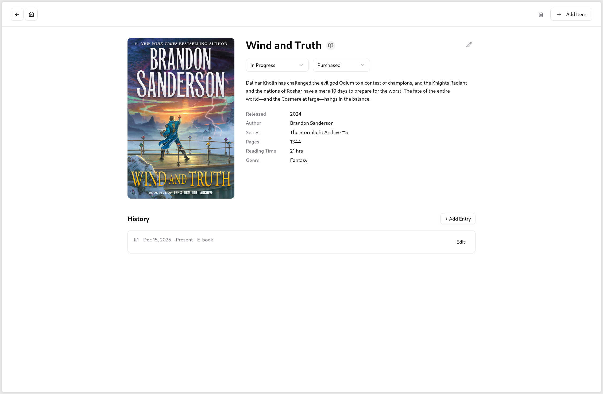
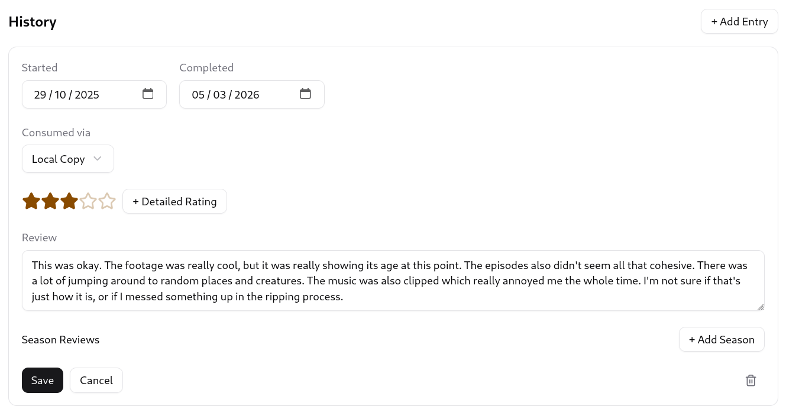
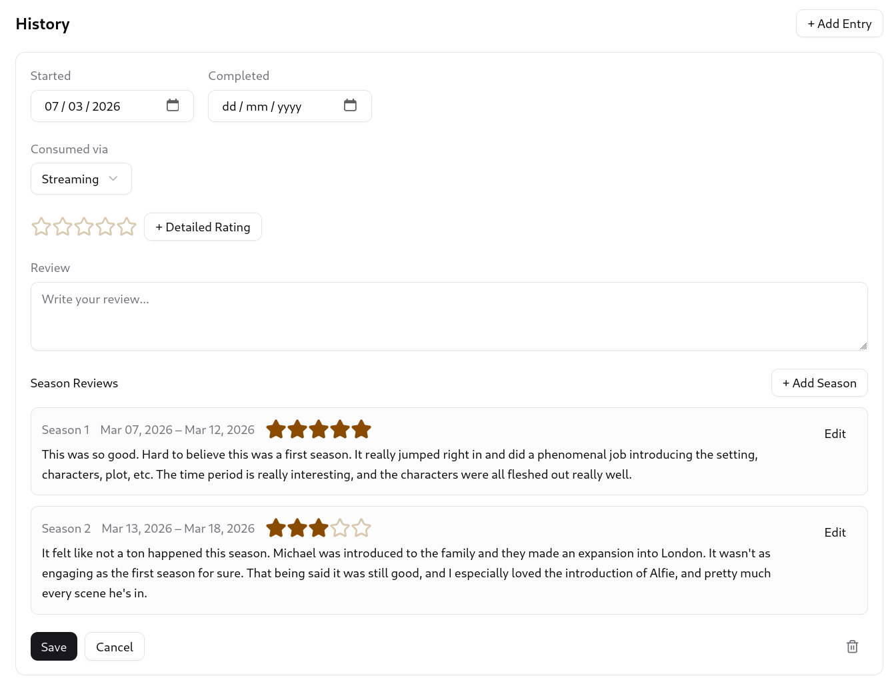
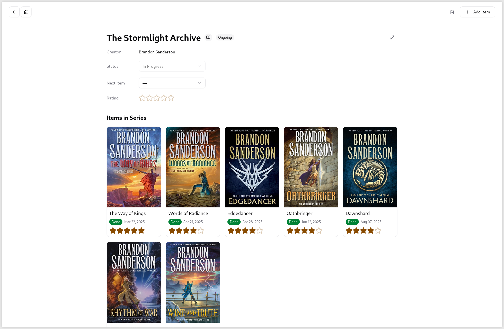
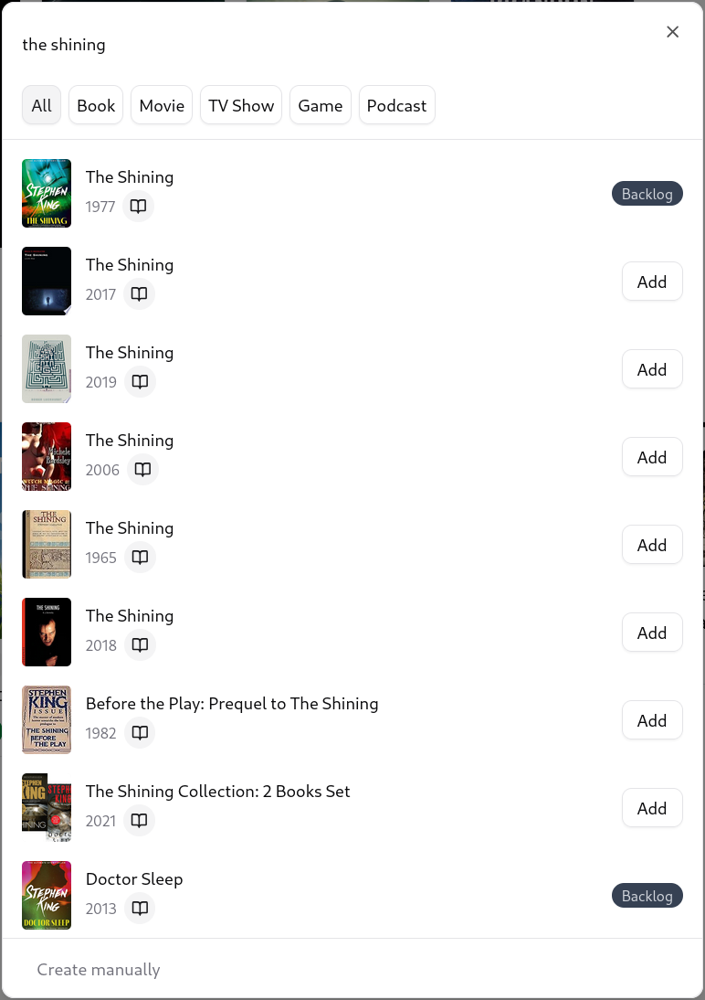

# What does this app do?
This app is a private, self-hosted way to track your media consumption.

Think Goodreads, but without the social aspects, and with support for movies, TV shows, video games, and podcasts in addition to books.

# Features
## Dashboard
A dashboard view shows you:
- What you're currently playing/reading/watching/listening to
- What's next up based on what's currently in progress and what you've finished recently
- A quick glance into things you've finished recently
- A configurable report about your media consumption

## Library
A library view lets you browse all items currently in your library.

You can search the library to find specific items, and you can filter and sort it however you'd like.

## Series
A series view lets you browse all series in your library.

It can also be filtered and sorted.

## Custom Views
Custom views let you create filtered and sorted views of your library that you can access quickly from the sidebar.

These can show either individual items:

or series:

## Item Details
Clicking into the card for an item in your library takes you to a detailed page that shows all of the metadata for that item.

This includes links out to the item's series (if it's in a series), the item's creator (author, director, etc.), and the item's genre.

All of the metadata shown on this screen is pulled from one of the APIs in the [External APIs](#external-apis) section.
 
It is also user-editable.

You can track multiple reads/watches/listens of an item by adding a history entry.
 The entries also allow you to track things like:
- When you started and finished the item
- How you consumed the item
- A rating for this read/watch/listen
- What your thoughts on the item were

TV shows let you track and review each season of the show individually.
 
Those ratings will then be averaged up to the show overall once you've completed every season.

## Series Details
Clicking into a series from a [series view](#series) or from the link in an [item's details](#item-details) will take you to a screen with details about that specific series.

It will show you all items in that series, in order.
 
The order will be based on either series number (books only) or release date (everything else).

Similar views exist for creators (authors, directors, etc.) and genres.

## Adding Items
Adding new items will search the APIs listed in the [External APIs](#external-apis) section for an item that matches your search term.

You can filter the search results based on the type of media that you want to add.

# Technical Details
This app was built using [Tanstack Start](https://tanstack.com/start/latest).

## Libraries Used
[PostgreSQL](https://www.postgresql.org/) for the database.
 
[Drizzle ORM](https://orm.drizzle.team/docs/overview) to query the database from TypeScript.
 
[Tailwind CSS](https://tailwindcss.com/) for styling.
 
[Zod](https://zod.dev/) for validating inputs to server functions.
 
[Shadcn](https://ui.shadcn.com/) for building block UI components.
 
[Recharts](https://recharts.github.io/) for displaying graphs and charts.
 
[Lucide React](https://lucide.dev/guide/packages/lucide-react) for icons.
 
[Better Auth](https://www.better-auth.com) for user auth.
 
[Vitest](https://vitest.dev/) for automated testing.
 
[Biome](https://biomejs.dev/) for linting and formatting.
 
[dnd kit](dndkit.com/overview) for drag-and-drop functionality.
 
[dotenv](https://www.npmjs.com/package/dotenv) for reading environment variables.
 
[T3 Env](https://env.t3.gg/) for type-safe environment variables.
 
[i18next](https://www.i18next.com/) for string internationalization.

## External APIs
[Hardcover](https://docs.hardcover.app/api/getting-started/) for books.
 
[IGDB](https://api-docs.igdb.com/#getting-started) for games.
 
[TMDB](https://developer.themoviedb.org/docs/getting-started) for movies and TV shows.
 
[iTunes](https://performance-partners.apple.com/search-api) for podcasts.

# How can you install and use this app?
This app is intended to be self-hosted on a server.

There's an example docker-compose file included that you can use to get started.

You'll also need to create a .env file and fill out the necessary variables in there.
 
.env.example lists out all of the variables and has documentation on where to get the various API keys needed.